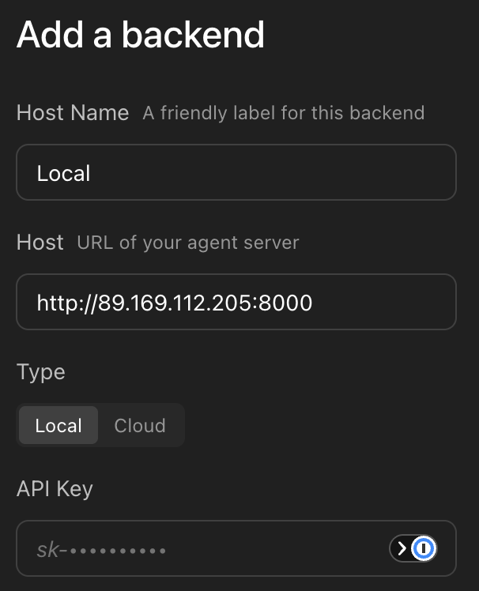
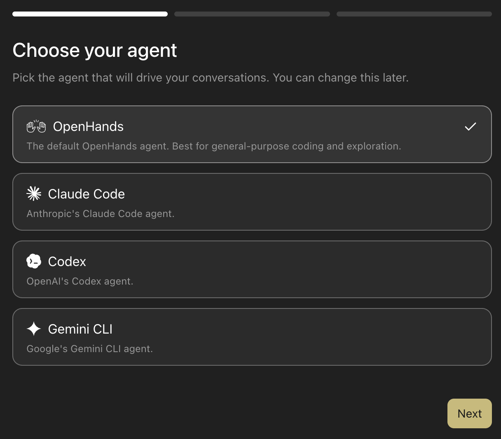
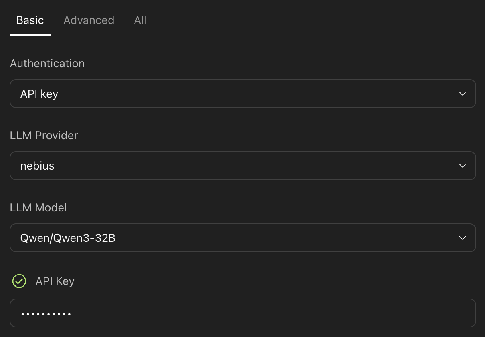

# OpenHands Agent Canvas on Nebius

> Run the OpenHands Agent Canvas on a Nebius VM, with Token Factory serving Qwen3-32B as the LLM.

The earlier recipes build an agent service from the ground up.
This recipe takes the opposite path: instead of writing your own FastAPI app, you run [OpenHands Agent Canvas](https://github.com/OpenHands/OpenHands) — a self-hosted control center for coding agents — on a Nebius Compute VM, and drive it with [Qwen3-32B](https://tokenfactory.nebius.com) served by Nebius Token Factory.

The result is a browser-accessible agent workbench where you can start conversations, run coding tasks, and set up automations — with both the compute and the LLM inference running on Nebius.

## What you'll set up

| Piece | Where it runs | What it does |
|---|---|---|
| Agent Canvas | Nebius Compute VM | Web UI + agent server, listening on port 8000 |
| OpenHands agent | Same VM | The agent that executes your tasks |
| Qwen3-32B | Nebius Token Factory | The LLM driving the agent, via an OpenAI-compatible API |

## Prerequisites

- A [Nebius Token Factory](https://tokenfactory.nebius.com) account
- A [Nebius Cloud](https://console.nebius.com) account with permission to create Compute VMs
- An SSH key pair for reaching the VM

## Step 1 — Create an API key in Token Factory

Token Factory is Nebius' inference platform.
It serves open models — including Qwen3-32B — behind an OpenAI-compatible API, and Agent Canvas supports it out of the box as the `nebius` LLM provider.

1. Go to [tokenfactory.nebius.com](https://tokenfactory.nebius.com) and sign in (Google or GitHub login works).
2. Open the **API keys** section and create a new key.
3. Copy the key somewhere safe — you will paste it into the Agent Canvas settings in Step 6.

You do not need to pre-provision anything for the model.
Qwen3-32B is served on shared infrastructure and billed per token.

## Step 2 — Set up a VM in Nebius Cloud

Create a Compute VM in the [Nebius console](https://console.nebius.com):

1. Go to **Compute** → **Create virtual machine**.
2. Pick a recent Ubuntu LTS image.
   A CPU-only flavor is fine — the LLM runs in Token Factory, not on this VM. 4 vCPUs and 16 GB RAM is a comfortable starting point.
3. Attach your SSH public key.
4. Make sure the VM gets a public IP address, and that its security group allows inbound TCP on port **22** (SSH) and port **8000** (the Agent Canvas UI).

Note the VM's public IP once it is running.
The rest of this recipe calls it `$VM_IP`.

> **Security note.**
> Port 8000 will expose the Agent Canvas UI to the internet, protected only by the API key you choose in Step 4.
> Pick a strong key, and consider restricting the security group rule to your own IP range.
> For production hardening (TLS, reverse proxy, SSO), see the [Agent Canvas self-hosting docs](https://docs.openhands.dev/openhands/usage/agent-canvas/backends).

## Step 3 — SSH into the VM and install dependencies

```bash
ssh ubuntu@$VM_IP
```

Agent Canvas needs Node.js 22.12+ (for the UI and CLI) and [uv](https://docs.astral.sh/uv/) (it launches the Python agent server via `uvx`):

```bash
# Node.js 22 (NodeSource)
curl -fsSL https://deb.nodesource.com/setup_22.x | sudo -E bash -
sudo apt-get install -y nodejs

# uv
curl -LsSf https://astral.sh/uv/install.sh | sh
source ~/.local/bin/env
```

## Step 4 — Install and start Agent Canvas

Install the package globally:

```bash
sudo npm install -g @openhands/agent-canvas
```

Then start it in **public mode** with a password of your choosing:

```bash
LOCAL_BACKEND_API_KEY=yourpassword agent-canvas --public
```

Two things are happening here:

- `LOCAL_BACKEND_API_KEY` sets the API key that protects the server.
  Replace `yourpassword` with a strong secret of your own.
- `--public` tells Agent Canvas *not* to auto-inject that key into the frontend.
  Anyone who loads the UI must enter the key themselves — which is exactly what you want on a VM with a public IP.

The first startup takes a minute or two while `uvx` pulls the agent server.
When the log settles, the full stack (frontend, agent server, automation backend) is listening behind a single ingress on port 8000.

> **Tip.** To keep Agent Canvas running after you disconnect, launch it inside `tmux`, or wrap it in a `systemd` unit once you are happy with the setup.

## Step 5 — Open the UI and unlock it

In your browser, go to:

```
http://$VM_IP:8000
```

Agent Canvas will ask you to add a backend.
The host and name are pre-filled — you only need the **API Key** field.
Enter the password you chose in Step 4 (the `LOCAL_BACKEND_API_KEY` value):



## Step 6 — Configure the OpenHands agent with Qwen3-32B

The setup wizard walks you through the agent and model configuration.

First, choose **OpenHands** as your agent:



Next, configure the LLM:

1. Set **Authentication** to `API key`.
2. Set **LLM Provider** to `nebius`.
3. Set **LLM Model** to `Qwen/Qwen3-32B`.
4. In the **API Key** field, paste the Token Factory key you created in Step 1.



Qwen3-32B is a dense 32B-parameter model with a 128k context window and strong tool-calling behavior — a good fit for agentic coding at a low per-token price.

## Step 7 — Start a conversation

That's it.
Start a new conversation and give the agent something to do:

> Create a small Python script that fetches the current Bitcoin price and prints it.

You should see the agent plan, run commands, and stream results back — every LLM call served by Qwen3-32B on Token Factory.
You can watch token usage accumulate in the [Token Factory console](https://tokenfactory.nebius.com).

## Troubleshooting

- **The UI never loads.** Check the security group allows inbound TCP 8000, and that `agent-canvas` is still running on the VM.
- **"Invalid API key" when adding the backend.** The key in the UI must exactly match the `LOCAL_BACKEND_API_KEY` value the server was started with.
- **The agent errors on its first LLM call.** Re-check the provider (`nebius`), the model ID (`Qwen/Qwen3-32B`), and that the Token Factory key was pasted without whitespace.
- **`agent-canvas` fails at startup.** Confirm `node --version` reports 22.12+ and `uv --version` works in the same shell.

## Going further

- **Harden the deployment.** Put the UI behind a reverse proxy with TLS, and read the [self-hosting guide](https://docs.openhands.dev/openhands/usage/agent-canvas/backends).
- **Set up automations.** Agent Canvas can run scheduled and webhook-triggered agents that integrate with Slack, GitHub, and Linear.
- **Try other Token Factory models.** The provider dropdown exposes the full Nebius catalog — swap models without touching the VM.
- **Build your own agent service.** If you want to own the whole stack instead, start from [recipe 01](../01-first-agent-on-nebius/).
